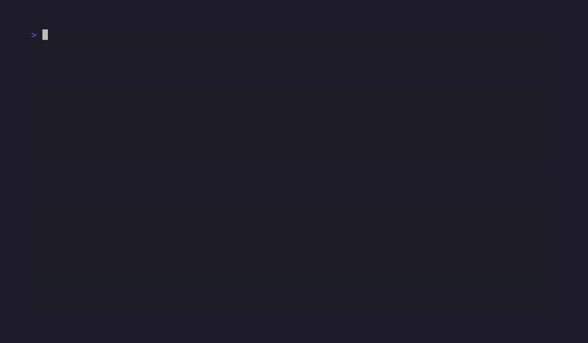

# Vault Graveyard Auditor

**Find out how much of your note vault is actually dead.**



Most "second brains" are graveyards. You clip articles, save threads, dump transcripts, and
none of it ever turns into a thought of your own. It looks productive. It does nothing.

Vault Graveyard Auditor scans your markdown / Obsidian vault and scores every note on one
question: **does this note carry your own take, or is it just a capture with no opinion?**
You get a graveyard score, your worst offenders, and a report you can act on.

It only reads your notes. It never edits or deletes anything.

```
$ python -m vaultaudit ~/ObsidianVault

  GRAVEYARD SCORE: 71% dead
  5 dead · 1 borderline · 1 alive  (of 7 notes)

  worst offenders (lowest score first):
    [ 15] clips/karpathy-thread.md        — no first-person take
    [ 15] clips/saas-pricing-guide.md     — mostly quoted source
    [ 30] reading/atomic-habits.md        — 1 first-person take marker(s)
    [ 60] ideas/distribution-beats-code.md — 3 first-person take marker(s)

  full report written to graveyard-report.md
```

## Why this exists

A note that only stores a source is a dead note. The value was never the clip. It is what
**you** think about it: where you agree, where it is wrong, how it connects to your own work.
A vault full of summaries is a pile of other people's ideas. A vault full of takes is a body
of work you can actually use.

This tool measures the difference, so you can stop hoarding and start producing.

## What it does

- Walks your vault recursively and reads every `.md` note.
- Scores each note **alive**, **borderline**, or **dead** based on whether it contains your
  own opinion (not a summary).
- Prints a **graveyard score** (the share of dead notes) and your worst offenders, each with
  the reason it scored low.
- Writes a full `graveyard-report.md` you can work through note by note.
- Runs fully offline with **zero dependencies**. An optional `--llm` flag uses Claude to
  sharpen the borderline calls if you want a second opinion.

## Use cases

- **Audit before a cleanup.** See exactly which notes are dead weight before you spend a
  weekend reorganizing a vault that was never producing anything.
- **Make capture earn its place.** Run it weekly. If your graveyard score is climbing, you
  are clipping more than you are thinking. The number keeps you honest.
- **Fix the worst offenders, not all of them.** The report sorts by score, so you can spend
  20 minutes adding your take to the 10 deadest notes instead of staring at 500.
- **Vet a vault template before you adopt it.** Point it at a "second brain starter" you
  cloned. If the example notes all score dead, the template optimizes for storage, not output.
- **Settle the Obsidian-vs-Claude-Code-vs-Notion debate for yourself.** The app does not
  matter. Run the auditor on whatever you use and look at the score. That is the only metric
  that counts.
- **Turn a writing habit into a number.** If you publish from your notes, alive notes are your
  raw material. Watch the alive count grow as you build a real body of work.

## Install

No packages required for the core. Clone and run:

```bash
git clone https://github.com/ogedai10/vault-graveyard-auditor.git
cd vault-graveyard-auditor
python -m vaultaudit /path/to/your/vault
```

Python 3.8+ is all you need.

## Usage

```bash
python -m vaultaudit <vault-path> [options]
```

| option | what it does |
| --- | --- |
| `--report PATH` | where to write the markdown report (default `./graveyard-report.md`) |
| `--top N` | how many worst offenders to print (default 10) |
| `--ignore DIR ...` | extra directory names to skip (on top of the defaults) |
| `--llm` | use Claude to re-judge borderline notes (needs `ANTHROPIC_API_KEY`) |
| `--json` | print the full results as JSON instead of the report (good for scripting) |

By default it skips `.obsidian`, `.git`, `_templates`, `node_modules`, and `.trash`.

## How a note is scored

The score is intentionally simple and explainable. Every note starts at zero, and these
signals move it up or down:

- **A "my take" style heading** (`## My Take`, `## Angle`, `## Opinion`) is a strong positive.
- **First-person stance language** ("i think", "i disagree", "the problem with", "what they
  miss", "hot take", and more) adds points, capped so one loud note cannot game it.
- **Enough of your own prose** (not quotes, not links) adds points.
- **Mostly quoted or clipped source** drags the score down.
- **A bare title plus a link** with no commentary drags it down hard.
- **A tiny stub** with no opinion drags it down.

Notes land in three buckets: **dead** (a capture with no take), **borderline** (some signal,
not much), and **alive** (your own thinking is clearly there). The graveyard score is the
percentage of notes that are dead.

It is a heuristic, not a judge. It will miss subtle takes and occasionally flag a terse one.
That is what `--llm` is for.

## Optional: sharper judgment with `--llm`

The offline heuristic is good enough to find the obvious graveyard. If you want a closer call
on the borderline notes, set an Anthropic API key and add `--llm`:

```bash
pip install anthropic
export ANTHROPIC_API_KEY=sk-ant-...
python -m vaultaudit ~/ObsidianVault --llm
```

It only sends the borderline notes to the model, so the cost stays small. If the key or the
package is missing, the tool tells you and falls back to the heuristic instead of failing.

## It will not touch your notes

The auditor is read-only. It opens your notes, scores them, and writes a single report file.
It never edits, moves, or deletes anything in your vault.

## License

MIT. Take it, fork it, make it yours.
